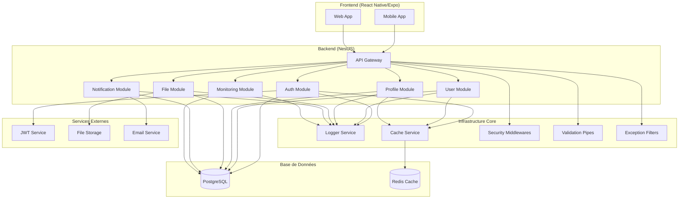
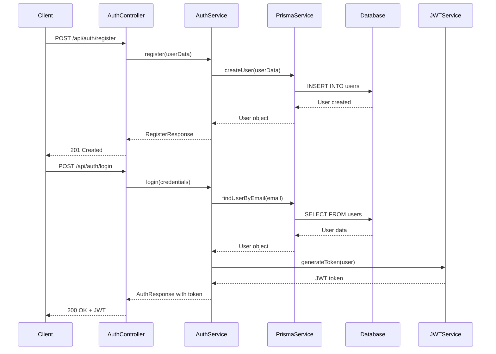
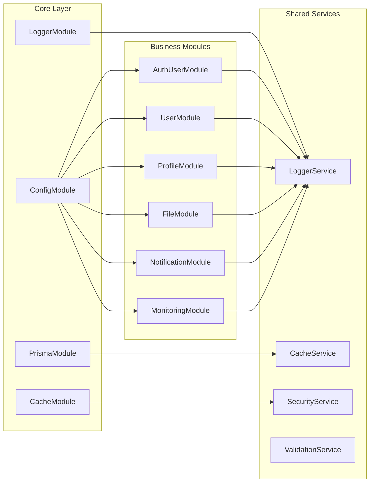
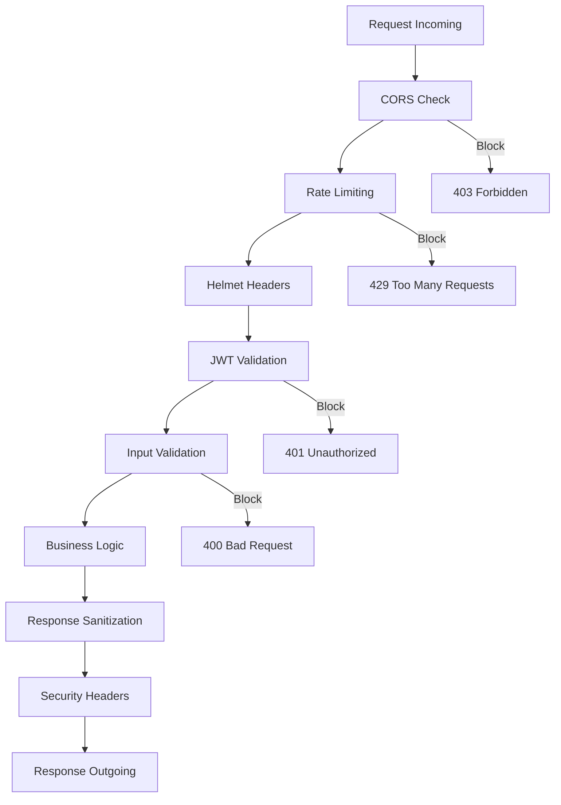
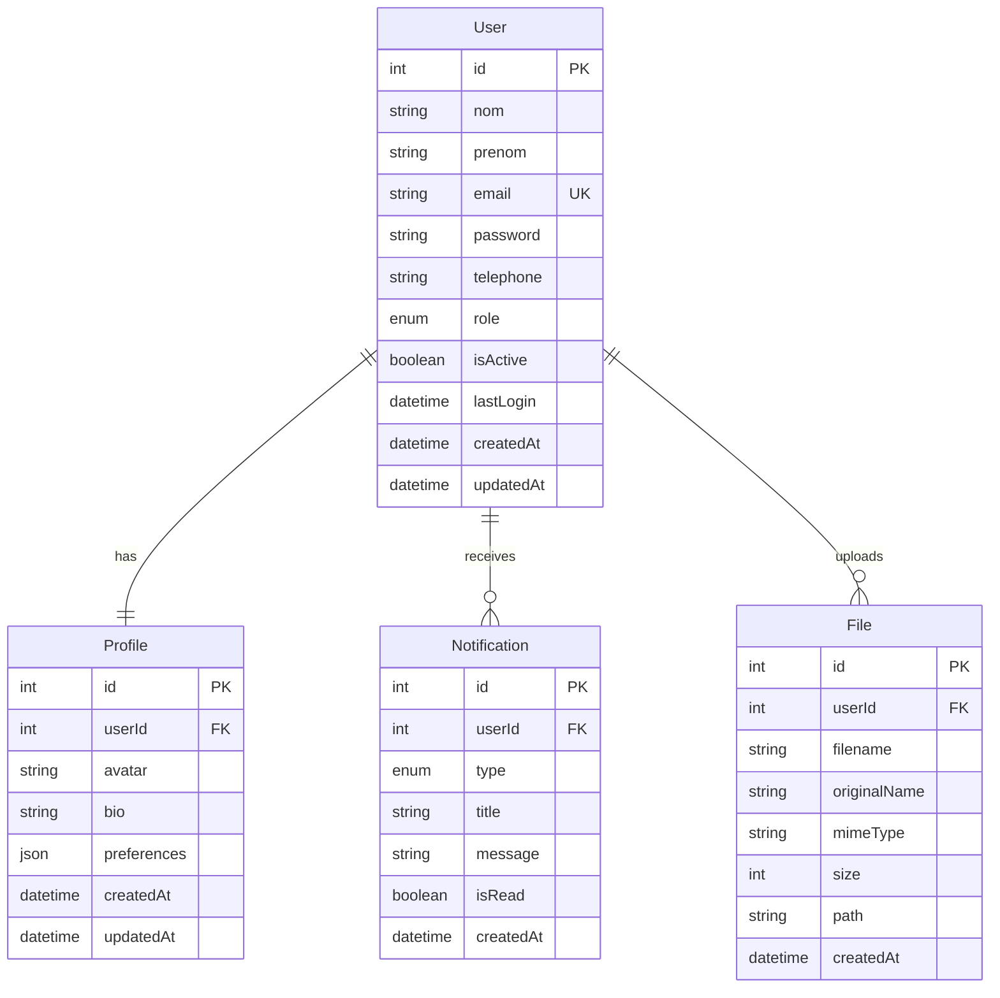
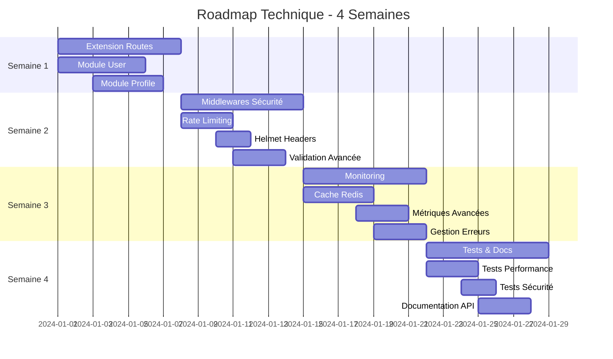
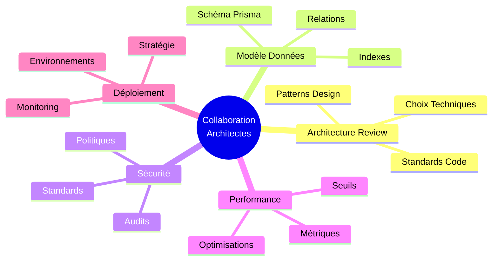

# Diagramme d'Architecture du Projet

## Architecture Globale



## Flux d'Authentification



## Structure des Modules



## Pipeline de Sécurité



## Modèle de Données



## Roadmap d'Implémentation



## Métriques de Performance

```mermaid
graph LR
    subgraph "Monitoring Endpoints"
        A[/health]
        B[/metrics]
        C[/logs]
        D[/security-events]
    end
    
    subgraph "Métriques Collectées"
        E[Response Time]
        F[Throughput]
        G[Error Rate]
        H[Memory Usage]
        I[Database Queries]
        J[Cache Hit Rate]
    end
    
    A --> E
    A --> H
    B --> F
    B --> G
    B --> I
    B --> J
    C --> G
    D --> G
```

## Points de Collaboration Architectes


